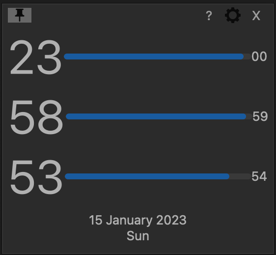

<center>
<h1> More Visible Clock</h1>
</center>

[](https://opensource.org/licenses/MIT)

MoreVisibleClock is a C++ app written with [Qt](https://www.qt.io/). It has the goal of visualizing the current hour, minute and  second with bars.

The app works by taking the current time and extracting each part to display with its own bar.
This will allow users to easily see the current time in a visual way.

## Prerequisites

* Qt 6.0.0 or higher
* C++ compiler

##  Installation

```bash
git clone
cd MoreVisibleClock
qmake
make
./MoreVisibleClock
```

## License

[MIT](https://choosealicense.com/licenses/mit/)
